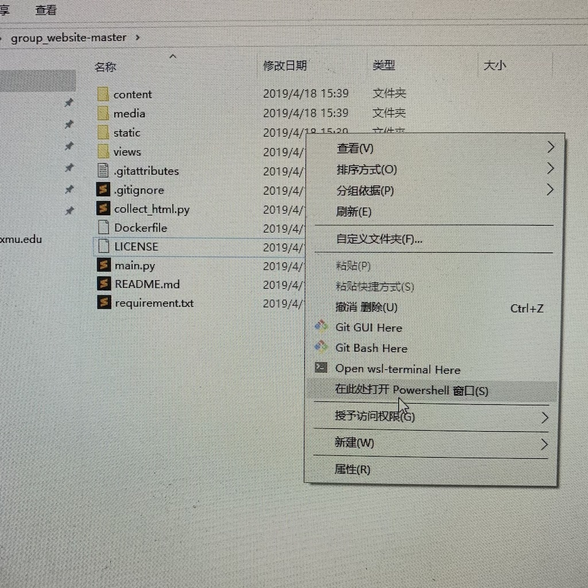

# group_website

The Wang Group website based on bottlepy.

The whole website is based on ***[bottlepy](https://bottlepy.org/docs/dev/index.html)***, contents of website were store in `group_website/content` folder and rendered by ***[SimpleTemplate Engine](https://bottlepy.org/docs/dev/stpl.html)***.

*Test on **Windows 10**, **Ubuntu 16.04** and **macOS 10.13.6**.*

### 依赖 Requirement:

1. python 3.6+
2. bottle 0.12+
3. requests 2.21+

### 使用方法 Use Method:

0. 安装依赖（请先自行安装Python3.6）
```
$ pip3 install -r requirement.txt
```
1. 在`group_website`文件夹内启动一个终端窗口，运行`main.py`来启动网页服务器。启动后可以通过访问查看网页。保持终端窗口打开以进行下一步操作。

2. 修改文件夹内的json文件以修改网页内容。json文件名与相应网页对应。修改保存后，刷新网页即可看到变化。在执行下一步前应检查修改的内容是否生效且无报错。

3. 在`group_website`文件夹内启动另一个终端窗口，运行`collect_html.py`来获得静态html文件
```
$ python3 collect_html.py
```

4. 打开`index.html`，并检查网页是否正常呈现。

5. 将html文件、`media`、`static`文件夹上传到ftp服务器上

---

0. Install requirement (assume Python3.6 is installed) 
```
$ pip3 install -r requirement.txt
```
1. Enter `group_website` folder and open an terminal then run `main.py` to start web server, the website will be at [127.0.0.1:8080](http://127.0.0.1:8080) by default. Keep this terminal open.
```
$ python3 main.py
```
2. Modify json file in `group_website/content` floder. Each one is related to the page of same name. The website will be reload automaticly after change. Check every detail you've modified and make sure the websites render normally (no error page).

3. Enter `group_website` folder and open **another** terminal then run `collect_html.py` to get static html file.
```
$ python3 collect_html.py
```

4. Open `index.html` in `group_website` folder and check if website renders normally.

5. Upload `*.html` and `media`, `static` folders to group ftp, so the website can be visit by link in XMU offical website.

### 图片路径 Image Path

图片文件都保存在`group_website/media`文件夹下。

All media image store in `media` folder.

`group_website/media/toc_image`  - for index page

`group_website/media/article_image` - for publications page

`group_website/media/person_image`  - for people page

`group_website/media/device_iamge`  - for laboratory page


### 如何在Windows10下打开终端？ How to Get Terminal in Windows10?

1. 进入`group_website`文件夹

2. 按住**SHIFT**键，并在文件夹内空白处单击右键

3. 选择"在此处打开PowerShell窗口"

---

1. enter `group_website` folder

2. press **SHIFT** key and right-click on blank field

3. click "open PowerShell here" or "在此处打开PowerShell窗口"




### TODO:

1. Automaticly upload to ftp after collecting static html

